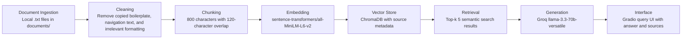

# Project 1 Planning: The Unofficial Guide

> Write this document before you write any pipeline code.
> Your spec and architecture diagram are what you'll use to direct AI tools (Claude, Copilot, etc.) to generate your implementation — the more specific they are, the more useful the generated code will be.
> Update the Retrieval Approach and Chunking Strategy sections if you change your approach during implementation.
> Update this file before starting any stretch features.

---

## Domain

This project will build an unofficial WGU Cybersecurity Student Survival Guide focused on student-shared advice about the BS Cybersecurity and Information Assurance program, including course difficulty, certification preparation, acceleration strategies, and common bottlenecks. This knowledge is valuable because official WGU pages explain program requirements, but they do not usually capture what students actually experience while trying to complete courses quickly, choose a course order, prepare for certification exams, or avoid common delays. The information is hard to find through official channels because it is scattered across Reddit threads, student writeups, course advice posts, and informal discussions rather than being organized in one searchable place.

---

## Documents

<!-- List your specific sources: URLs, subreddit names, forum threads, or file descriptions.
     Aim for at least 10 sources that together cover different subtopics or perspectives within your domain. -->

| # | Source | Description | URL or location |
|---|--------|-------------|-----------------|
| 1 | WGU BSCSIA Program Page | Official baseline for what the cybersecurity degree includes, including program/certification information. | https://www.wgu.edu/online-it-degrees/cybersecurity-information-assurance-bachelors-program.html |
| 2 | WGU BSCSIA Program Guide PDF | Official program guide used as a reference point for courses and program structure. | https://www.wgu.edu/content/dam/wgu-65-assets/western-governors/documents/program-guides/information-technology/BSCSIA.pdf |
| 3 | Reddit: Completed BSCSIA in 159 Days | Student writeup about finishing the BSCSIA quickly, course order, pacing, and acceleration experience. | https://www.reddit.com/r/WGU/comments/11n8862/completed_bscsia_in_159_days_14_classes_master/ |
| 4 | Reddit: How are people finishing in one term? | Student discussion about whether one-term acceleration is realistic and what study time it requires. | https://www.reddit.com/r/WGU/comments/11suupz/how_are_people_finishing_in_one_term/ |
| 5 | Reddit: Fast-tracking BSCSIA with Certifications | Student thread about using prior certifications/transfer credit to accelerate the BSCSIA. | https://www.reddit.com/r/WGUCyberSecurity/comments/13iq9ny/seeking_advice_fasttracking_bscsia_at_wgu_with/ |
| 6 | Reddit: Review of the Bachelor's in Cybersecurity Program | Student review that identifies hard classes and gives program-level pros/cons. | https://www.reddit.com/r/WGUCyberSecurity/comments/1fw9i57/my_review_of_the_bachelors_in_cybersecurity/ |
| 7 | Reddit: Hardest Courses in Cybersecurity Program | Student discussion about difficult courses/certifications such as PenTest+, A+, cloud/security courses, and related bottlenecks. | https://www.reddit.com/r/WGUCyberSecurity/comments/1cwrg2l/what_are_the_hardest_courses_in_the_cybersecurity/ |
| 8 | Reddit: BSCSIA Capstone Done | Student advice about the capstone and difficult database courses. | https://www.reddit.com/r/WGU/comments/o13eym/bscsia_capstone_done/ |
| 9 | Reddit: WGU Cyber Security Course/Certification List | Student discussion about which certifications map to cybersecurity degree courses. | https://www.reddit.com/r/WGUCyberSecurity/comments/p9m3c1/wgu_cyber_security_course_certification_list/ |
| 10 | Reddit: What Courses Will My CompTIA Certifications Cover? | Student discussion of CompTIA certification course equivalencies and transfer credit. | https://www.reddit.com/r/WGU/comments/1dhp4v7/what_courses_will_my_comptia_certifications_cover/ |

---

## Chunking Strategy

<!-- How will you split documents into chunks?
     State your chunk size (in tokens or characters), overlap size, and explain why those
     numbers fit the structure of your documents.
     A review-heavy corpus warrants different chunking than a long FAQ. -->

**Chunk size:** 800 characters

**Overlap:** 120 characters

**Reasoning:**  
The source documents for this project are a mix of official program pages, student Reddit threads, and informal student writeups. These documents are usually longer and less structured than board game rules, but the useful information often appears in short paragraphs or clusters of advice about a course, certification, or acceleration strategy. An 800-character chunk is large enough to preserve context around a student’s claim, such as which course or certification they are discussing and why they found it difficult, while still being small enough to avoid merging too many unrelated topics into one embedding. A 120-character overlap helps preserve meaning when an important sentence or course-specific explanation falls across a chunk boundary. If chunks are too small, retrieval may return fragments that lack the course name or context; if chunks are too large, retrieval may return broad posts that mention many courses but do not directly answer the user’s specific question.

---

## Retrieval Approach

<!-- Which embedding model are you using (e.g., all-MiniLM-L6-v2 via sentence-transformers)?
     How many chunks will you retrieve per query (top-k)?
     If you were deploying this for real users and cost wasn't a constraint, what tradeoffs
     would you weigh in choosing a different embedding model — context length, multilingual
     support, accuracy on domain-specific text, latency? -->

**Embedding model:** sentence-transformers/all-MiniLM-L6-v2

**Top-k:** 5 chunks per query

**Production tradeoff reflection:**  
I will use `all-MiniLM-L6-v2` because it runs locally, is fast, does not require an API key, and is appropriate for a small student-knowledge corpus. I will retrieve the top 5 chunks per query because student advice is often spread across multiple posts, and a single query may need context from more than one source. Retrieving too few chunks could miss the most relevant student experience, while retrieving too many could add noisy or conflicting opinions that make the answer less grounded. For a production system, I would compare embedding models based on retrieval accuracy, latency, context length, cost, multilingual support, and how well they handle informal student language, acronyms, course codes, and certification names. If cost were not a constraint, I would test a stronger API-based embedding model against the local model and choose based on evaluation results rather than model popularity alone.

---

## Evaluation Plan

<!-- List your 5 test questions with their expected correct answers.
     Questions should be specific enough that you can judge whether the system's response
     is right or wrong. "What are good dining halls?" is too vague.
     "What do students say about wait times at [dining hall name] during lunch?" is testable. -->

| # | Question | Expected answer |
|---|----------|-----------------|
| 1 | What do students say are common ways to accelerate the WGU BSCSIA program? | Students commonly mention transferring in credits, using existing certifications, studying consistently, choosing an efficient course order, and dedicating significant weekly time to coursework. |
| 2 | What do students say are some of the hardest or most time-consuming parts of the WGU cybersecurity program? | Students often identify certification-heavy courses, difficult technical courses, database-related courses, PenTest+/security courses, and the capstone as potential bottlenecks, depending on prior experience. |
| 3 | What certifications or prior credits can help reduce the number of WGU cybersecurity courses a student needs to complete? | CompTIA certifications and other transfer credits may satisfy some course requirements, but the exact coverage depends on WGU’s current transfer policy and the student’s transcript evaluation. |
| 4 | What advice do students give for preparing for cybersecurity certification courses at WGU? | Students generally recommend using outside study resources, practice exams, structured study plans, and focusing on the certification objectives rather than relying only on course material. |
| 5 | What do students say about finishing the BSCSIA in one term? | Some students report finishing quickly or in one term, but it usually requires prior knowledge, transfer credits, strong time commitment, and careful pacing; it is not realistic for every student. |

---

## Anticipated Challenges

<!-- What could go wrong? Name at least two specific risks with reasoning.
     Consider: noisy or inconsistent documents, missing source attribution, off-topic
     retrieval, chunks that split key information across boundaries. -->

1. Student-generated documents may be noisy, inconsistent, or opinion-based. Two students may describe the same WGU course differently depending on their prior experience, transfer credits, study habits, or certification background. This could cause the system to retrieve conflicting chunks or generate an answer that sounds more certain than the sources really are.

2. Retrieval may mix together different courses, certifications, or program requirements because many posts mention similar terms such as Security+, CySA+, PenTest+, transfer credits, and acceleration. If a query is too broad, the top-k results may include related but not directly relevant chunks, which could make the generated answer partially accurate instead of fully grounded.

3. Important context may be split across chunk boundaries. For example, one sentence may name a course or certification, while the next sentence explains why it was difficult. The 120-character overlap is intended to reduce this risk, but some longer explanations may still be divided across chunks.

---

## Architecture

---

## AI Tool Plan

<!-- For each part of the pipeline below, describe:
     - Which AI tool you plan to use (Claude, Copilot, ChatGPT, etc.)
     - What you'll give it as input (which sections of this planning.md, which requirements)
     - What you expect it to produce
     - How you'll verify the output matches your spec

     "I'll use AI to help me code" is not a plan.
     "I'll give Claude my Chunking Strategy section and ask it to implement chunk_text()
     with my specified chunk size and overlap" is a plan. -->

**Milestone 3 — Ingestion and chunking:**  
I will use ChatGPT to help implement the document ingestion and chunking code after I provide the Domain, Documents, Chunking Strategy, and Architecture sections from this planning file. I expect the AI tool to produce code that loads `.txt` files from the `documents/` folder, cleans obvious boilerplate, splits text into 800-character chunks with 120-character overlap, and attaches source metadata. I will verify the output by printing at least 5 sample chunks and checking that each chunk is readable, substantive, and connected to the correct source.

**Milestone 4 — Embedding and retrieval:**  
I will use ChatGPT to help implement the embedding and retrieval functions after I provide the Retrieval Approach section and the architecture diagram. I expect the AI tool to produce code using `sentence-transformers/all-MiniLM-L6-v2`, ChromaDB, and top-k semantic search. I will verify the output by running at least 3 evaluation queries, inspecting the retrieved chunks and distance scores, and confirming that the returned chunks visibly relate to the question.

**Milestone 5 — Generation and interface:**  
I will use ChatGPT to help implement the grounded generation prompt and Gradio interface after I provide the grounding requirements from the project instructions and my Retrieval Approach section. I expect the AI tool to produce code that sends retrieved chunks to Groq `llama-3.3-70b-versatile`, instructs the model to answer only from retrieved context, and displays both the answer and source citations in the interface. I will verify the output by testing at least two supported questions and one out-of-scope question, then checking whether the system cites sources and refuses to answer when the documents do not contain enough information.
